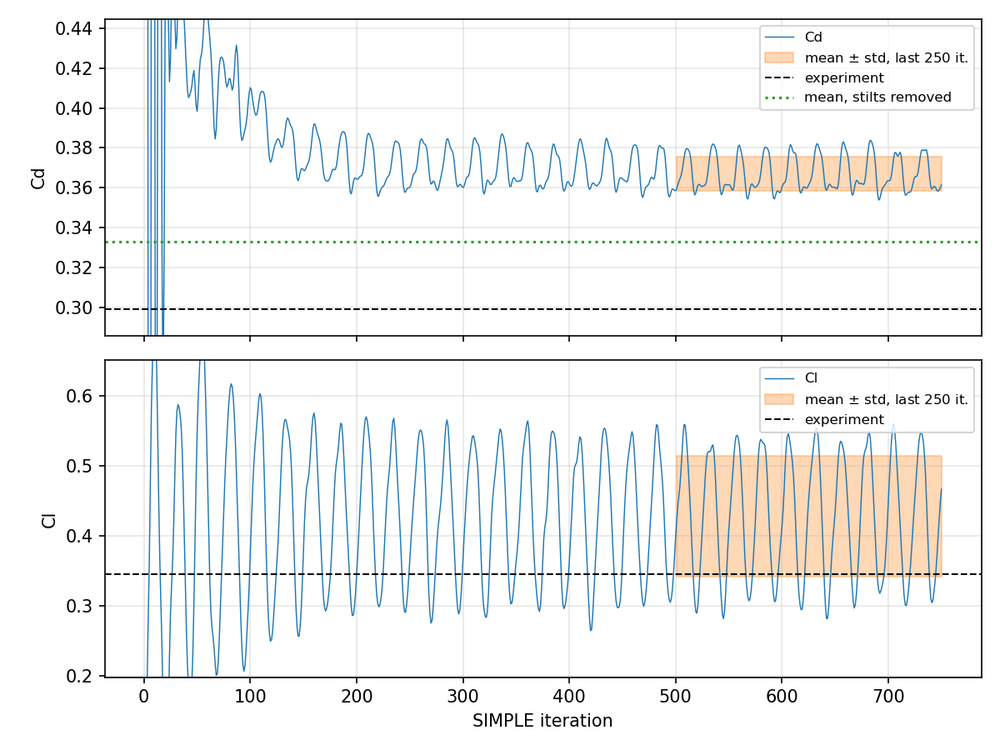

# Ahmed body (25°) — RANS validation with OpenFOAM

Steady RANS simulation of the flow around the Ahmed body with a 25° slant at
Re = 2.78 × 10⁶, meshed with snappyHexMesh and solved with simpleFoam and the
k-ω SST model in OpenFOAM v2606 (ESI). The aerodynamic forces are validated
against the wind-tunnel measurements of Meile et al. (2011).

> [!IMPORTANT]
> **The experimental drag excludes the stilts.** Meile et al. (2011) measured
> the loads on the four supporting stilts separately and subtracted them from
> the balance reading, while a CFD force integration over the full geometry
> includes them. Integrating over the body alone gives **Cd = 0.333 (+11 %)**
> instead of 0.367 (+23 %): the stilts alone account for ΔCd = 0.034, half of
> the apparent discrepancy. See [Stilt contribution](#stilt-contribution).

## Results at a glance

|                                                    | Cd                | Cl                |
|----------------------------------------------------|-------------------|-------------------|
| Experiment (Meile et al., 2011), stilt loads removed | 0.299           | 0.345             |
| **This work, body only**                           | **0.333** (+11 %) | 0.428 (+24 %)     |
| This work, body + stilts                           | 0.367 ± 0.009     | 0.428 ± 0.086     |
| SimFlow validation case (k-ω SST, 16.6 M cells)    | 0.313             | 0.355             |

Values are the mean ± standard deviation over iterations 500–750 (see
[Convergence](#convergence)). The walls of the stilts are vertical, so their
pressure force has no vertical component and Cl is the same with or without them.

---

## 1. Case setup

### Geometry

The Ahmed body (Ahmed et al., 1984) is a generic car shape: a rounded front, a
straight mid-section and a slanted rear surface whose angle controls the wake.
At 25° the slant carries a pair of strong longitudinal vortices from its side
edges, and the flow is close to the critical angle (about 30°) at which it
switches to a fully separated regime. This makes it a demanding test for RANS
models.

The geometry was modelled in CATIA V5 and exported as STL, including the four
cylindrical stilts that hold the body above the floor.

<p align="center">
  
</p>

| Length L | Width W | Height H | Ground clearance | Slant angle | Frontal area A |
|----------|---------|----------|------------------|-------------|----------------|
| 1.044 m  | 0.389 m | 0.288 m  | 0.050 m          | 25°         | 0.112 m²       |

### Flow conditions

| Quantity                          | Value                                          |
|-----------------------------------|------------------------------------------------|
| Free-stream velocity U∞           | 40 m/s                                         |
| Kinematic viscosity ν             | 1.5 × 10⁻⁵ m²/s                                |
| Reynolds number Re = U∞L/ν        | 2.78 × 10⁶                                     |
| Inlet turbulence intensity I      | 1 % → k = 1.5 (U∞ I)² = 0.24 m²/s²             |
| Inlet eddy-viscosity ratio νt/ν   | 1 → ω = k/ν = 16 000 s⁻¹                       |

### Domain and boundary conditions

The domain is a box of 11 × 2 × 2 m: x from −5 to 6 m (flow in +x), y from
−1 to 1 m, and z from −0.05 m (floor) to 1.95 m, with the body underside at
z = 0. The blockage ratio is 2.8 %, against 3.8 % in the experimental wind tunnel.

| Patch             | U                     | p              | k                 | ω                   | νt                 |
|-------------------|-----------------------|----------------|-------------------|---------------------|--------------------|
| inlet             | fixedValue (40 0 0)   | zeroGradient   | fixedValue 0.24   | fixedValue 16 000   | calculated         |
| outlet            | inletOutlet           | fixedValue 0   | inletOutlet       | inletOutlet         | calculated         |
| Body (incl. stilts) | noSlip              | zeroGradient   | kqRWallFunction   | omegaWallFunction   | nutkWallFunction   |
| bottom (floor)    | noSlip                | zeroGradient   | kqRWallFunction   | omegaWallFunction   | nutkWallFunction   |
| top, sides        | symmetryPlane         | symmetryPlane  | symmetryPlane     | symmetryPlane       | symmetryPlane      |

### Numerics

| Item                    | Setting                                             |
|-------------------------|-----------------------------------------------------|
| Solver                  | simpleFoam (steady, incompressible, SIMPLE)         |
| Turbulence model        | k-ω SST (Menter, 1994)                              |
| Convection, U           | bounded Gauss linearUpwind grad(U)                  |
| Convection, k and ω     | bounded Gauss limitedLinear 1                       |
| Gradients               | cellLimited Gauss linear 1                          |
| Laplacian               | Gauss linear limited corrected 0.33                 |
| Pressure solver         | GAMG                                                |
| Under-relaxation        | p 0.2, U 0.8, k and ω 0.7                           |
| Initialisation          | potential flow (potentialFoam)                      |
| Run                     | 750 iterations, 5 MPI ranks, mesh renumbered        |

---

## 2. Mesh

### How snappyHexMesh builds the mesh

The mesh starts from a uniform background of cubic cells generated by blockMesh
(110 × 20 × 20 cells of 0.1 m). snappyHexMesh then works in three stages:

1. **Castellation.** Cells cut by the STL surface or lying inside refinement
   regions are split, and the cells inside the body are removed. The result is
   a staircase approximation of the geometry.
2. **Snapping.** The points of the staircase are moved onto the true surface, so
   that the boundary follows the geometry.
3. **Layer addition.** Thin cells are inserted along the wall to resolve the
   steep velocity gradient of the boundary layer (see [Section 3](#3-near-wall-resolution-and-y)).

Refinement is expressed in **levels**: each level halves the cell edge, so a
volume refined by one level contains eight times as many cells.

| Level | Cell edge | Used for                                                       |
|-------|-----------|----------------------------------------------------------------|
| 0     | 100 mm    | background mesh                                                |
| 2     | 25 mm     | wake box, extending about six body lengths downstream          |
| 3     | 12.5 mm   | box around the body; flat box along the floor                  |
| 4     | 6.25 mm   | body surface (minimum level)                                   |
| 5     | 3.1 mm    | curved regions and sharp edges of the body                     |

Two different mechanisms produce these levels, and the difference matters:

- **Surface refinement** refines only the cells *cut by* the surface. Around the
  body this produces a thin shell, a few cells thick, at levels 4–5; the volume
  just outside it is at level 3. A setting of `level (4 5)` means level 4
  everywhere and level 5 only where the surface normal turns by more than
  `resolveFeatureAngle`. Flat panels therefore stay at level 4.
- **Region refinement** fills a whole volume (the boxes above) at the requested
  level, independently of the surface.

### The slant edge

The edge between the roof and the slant is where the flow over the slant
separates, so it must be represented sharply. With the common default settings
it is not:

- `surfaceFeatureExtract` marks an edge as a feature when the angle between the
  two faces is below `includedAngle` (default 150°). At a 25° slant the
  roof–slant angle is 155°, so the edge is **not extracted**, and snapping
  rounds it off over about one cell.
- snappyHexMesh raises the surface to its maximum level where the normal turns
  by more than `resolveFeatureAngle` (default 30°). Here the normal turns by 25°,
  so the edge is **not refined** either.

This case uses `includedAngle 165`, `resolveFeatureAngle 20` and feature-edge
refinement at level 5, which captures the edge.

### Boundary layers

Two layers are extruded on the body, with a first-layer thickness of 1.0 mm and
an expansion ratio of 1.1 (total 2.1 mm). snappyHexMesh reports 1.99 layers on
average and 98.5 % of the requested thickness over the 58 619 body faces.

Layer addition is the stage that most often fails, and it fails silently:
snappyHexMesh inserts layers by shrinking the existing cells, and when the
requested thickness is too small compared with the local cell it may extrude
nothing without reporting an error. A first attempt with twelve layers and a
0.02 mm first layer produced *zero* layers on 51 268 faces. The line to check in
the log is

```
Extruding N out of M faces (x%)
```

### Final mesh

2 820 668 cells. `checkMesh` passes all quality checks.

---

## 3. Near-wall resolution and y+

### What y+ measures

At a wall the fluid is at rest, and within a few millimetres it reaches the
free-stream speed. The structure of this boundary layer is universal when
distances and velocities are expressed in *wall units*:

$$y^+ = \frac{y\,u_\tau}{\nu}, \qquad u^+ = \frac{u}{u_\tau}, \qquad u_\tau = \sqrt{\tau_w/\rho}$$

where y is the distance from the wall and τ_w the wall shear stress. In these
units every turbulent boundary layer has three regions:

| Region            | y+          | Velocity profile                                  |
|-------------------|-------------|---------------------------------------------------|
| Viscous sublayer  | below ~5    | linear, u+ = y+                                   |
| Buffer layer      | ~5 to ~30   | transition, no simple law                         |
| Log layer         | ~30 to a few hundred | logarithmic, u+ = (1/κ) ln y+ + B, κ ≈ 0.41, B ≈ 5.2 |

In a mesh, the y+ that matters is the one of the **centre of the first cell**
at the wall.

### Two consistent strategies

- **Resolve the boundary layer** (y+ ≈ 1): the first cell lies in the viscous
  sublayer and the velocity gradient is computed directly. Accurate, but it
  requires many very thin cells.
- **Model it with wall functions** (y+ ≈ 30–300): the first cell lies in the log
  layer, and the log law is used to infer the wall shear stress from the
  velocity at the cell centre. Much cheaper, and valid for attached boundary
  layers.

The buffer layer (5 < y+ < 30) is the range to avoid: there, neither the linear
nor the logarithmic law holds.

### y+ is a result, not an input

The friction velocity u_τ depends on the solution, so y+ cannot be imposed.
It changes along the body — high on the nose and roof, where the flow is fast
and attached, low near separation — and it can only be measured after a run.
The procedure is to estimate the first-cell thickness, run, measure y+, and
adjust.

### Choice in this case

This case uses wall functions, like the SimFlow validation case and Meile et
al. (2011), with a target y+ ≈ 50. The first-layer thickness was calibrated on a
previous run (first layer 0.5 mm → mean y+ ≈ 24): doubling it predicted
y+ ≈ 50, and the measured mean is 50.

| Patch          | y+ min | y+ mean | y+ max |
|----------------|--------|---------|--------|
| Body           | ~1.5   | 50      | ~200   |
| Floor (bottom) | ~15    | ~620    | ~2200  |

On the body, most of the surface lies in the log layer; the lowest values
occur where the flow slows down near separation. The floor has no layers and
remains coarse far from the body (see [Discussion](#6-discussion)).

> **A pitfall in reading y+.** With low-Re wall treatment (`nutLowReWallFunction`)
> the wall shear stress is computed assuming the linear profile of the viscous
> sublayer. If the first cell actually lies in the log layer, the reported y+ is
> underestimated: for a true y+ ≈ 200, where u+ ≈ 18, the reported value is
> about √(18 × 200) ≈ 60. This was observed in this study: the same mesh gave a
> mean y+ of 62 with low-Re wall functions and 200 with log-law wall functions.

---

## 4. How to run

Requirements: OpenFOAM v2606 (ESI) with MPI, about 6 GB of RAM, and Python 3
with NumPy and Matplotlib for the plots.

```bash
./scripts/Allrun      # mesh, initialise and solve (5 MPI ranks)
./scripts/Allclean    # remove everything Allrun generates
```

The number of MPI ranks is read from `case/system/decomposeParDict`. To plot the
convergence history and print the statistics, copy each
`case/postProcessing/forceCoeffs/<start>/coefficient.dat` to
`results/data/coefficient_<start>.dat` (zero-padded, e.g. `coefficient_0000.dat`)
and run

```bash
python3 scripts/plot_coefficients.py
```

---

## 5. Results

### Convergence

<p align="center">
  
</p>

The mean drag settles within 1 % of its final value after about 220 iterations:

| Iterations | 200–300 | 300–400 | 400–500 | 500–750 |
|------------|---------|---------|---------|---------|
| Mean Cd    | 0.370   | 0.369   | 0.368   | 0.367   |

The coefficients do not converge to a fixed value but keep oscillating around
their mean with a regular period of 25 iterations: ± 2.3 % on Cd and ± 20 % on
Cl (one standard deviation). The oscillation sits almost entirely on the rear
axle (σ = 0.11 on Cl(r) against 0.026 on Cl(f)) and is almost purely vertical:
the ratio of the Cd and Cl fluctuations is 0.07, whereas a pressure fluctuation
on the slant would give tan 25° ≈ 0.47. It therefore originates on horizontal
surfaces at the rear rather than on the slant. The most likely explanation is a
steady solver applied to a wake that is intrinsically unsteady; this has not
been tested.

### Stilt contribution

The force coefficients are additive over parts of the surface, so the
contribution of the stilts can be measured by integrating the pressure over
them alone. In ParaView (6.1), on the `Body` patch at iteration 750:

1. `Clip` with a horizontal plane 1 mm below the body underside, keeping only the stilts;
2. `Extract Surface`, then `Surface Normals` with cell normals;
3. `Calculator` on cell data: `p*Normals_X`;
4. `Integrate Variables`, and division by ½ U∞² A = 89.6 m⁴/s²
   (simpleFoam's p is kinematic, p/ρ).

The procedure was first verified on the whole body, where it reproduces the
pressure drag reported by the `forceCoeffs` function object to within 2 %.

On the stilts it gives **ΔCd = 0.034**, about half of what four isolated
cylinders in free stream would produce: they sit in the floor boundary layer,
and the rear pair is in the wake of the front pair. Only the direct pressure
force is included; the effect of the stilts on the underbody flow, and their
small viscous drag, are not.

### Flow field

<p align="center">
  
</p>

Velocity magnitude on the symmetry plane. The flow stagnates on the nose and
accelerates over the front roof edge and at the slant edge; a low-speed region
develops over the slant and merges into the recirculating near wake behind the
base, with its upper and lower vortices. The thin low-speed band along the floor
is the ground boundary layer.

The lift is carried entirely by the rear axle (Cl(f) = −0.039, Cl(r) = 0.467),
consistent with the suction on the slant.

---

## 6. Sensitivity study

All runs use the 25° geometry and a body surface refinement of `level (4 5)`.

| Run | Change                                                             | Body y+ (mean) | Cd (body + stilts) | Cl              |
|-----|--------------------------------------------------------------------|----------------|--------------------|-----------------|
| A   | no layers                                                          | —              | ≈ 0.40             | —               |
| B   | 3 layers, first layer 0.5 mm                                       | 24             | 0.385 *            | 0.439 *         |
| C   | no layers (12 requested, none extruded); floor refinement box added | 200            | 0.402 ± 0.010      | 0.397 ± 0.097   |
| D   | 2 layers, first layer 1.0 mm; slant edge captured                  | 50             | 0.367 ± 0.009      | 0.428 ± 0.086   |

\* single-iteration values at the end of the run, not averages.

---

## 7. Discussion

### What the study establishes

- **The stilts are the largest single correction.** Excluding them, as the
  experiment does, lowers Cd from 0.367 to 0.333.
- **Drag is insensitive to the wall treatment.** Runs A–C span mean y+ from 24
  to 200 and give Cd between 0.385 and 0.402. Pressure drag dominates (the
  viscous part is below 10 % of the total), so the wall treatment matters mainly
  through its effect on separation.
- **Capturing the slant edge together with the new layers** lowered Cd from
  0.402 to 0.367. The two changes were made together and their contributions
  are not separated.

### Open sources of discrepancy

- **Resolution.** 2.8 million cells, against 16.6 million in the SimFlow case
  and 4.5–5 million in Meile et al. (2011). The volume just outside the
  near-wall shell, where the slant shear layer and the side-edge vortices
  develop, is at 12.5 mm.
- **Floor boundary layer.** The ERCOFTAC recommendations specify a thickness of
  about 30 mm, 0.4 m ahead of the nose. Here the floor is no-slip from the
  inlet, about 4.6 m upstream, which gives an estimated 65 mm (turbulent
  flat-plate estimate); the mean floor y+ is about 620. Meile et al. used a
  slip floor on the upstream part of the tunnel to match the recommended value.
- **Stilt interference.** Only the direct stilt force was removed; the stilts
  also modify the underbody flow.
- **Turbulence model.** Lift is over-predicted by 24 %. Meile et al. (2011) also
  over-predict the forces at 25° with a Reynolds-stress model (lift by about
  12 %), and two-equation models are known to struggle with the 25° slant,
  which lies close to the critical angle.
- **Blockage** is lower than in the experiment (2.8 % against 3.8 %). Lower
  blockage lowers the drag, so it cannot explain an over-prediction.

---

## Repository structure

```
case/
  0.orig/        initial and boundary conditions
  constant/      physical properties and the STL geometry (triSurface/)
  system/        mesh, numerics and run control
scripts/
  Allrun, Allclean, plot_coefficients.py
results/
  data/          force coefficients and y+ history
  figures/       images used in this README
```

## References

- S. R. Ahmed, G. Ramm, G. Faltin (1984). *Some salient features of the
  time-averaged ground vehicle wake.* SAE Technical Paper 840300.
- W. Meile, G. Brenn, A. Reppenhagen, B. Lechner, A. Fuchs (2011). *Experiments
  and numerical simulations on the aerodynamics of the Ahmed body.* CFD Letters
  3(1), 32–39.
- F. R. Menter (1994). *Two-equation eddy-viscosity turbulence models for
  engineering applications.* AIAA Journal 32(8), 1598–1605.
- ERCOFTAC Classic Collection, Ahmed body test case (Lienhart & Becker data).
- SimFlow, *Flow around the Ahmed Body – Validation Case*,
  https://help.sim-flow.com/validation/ahmed-body
